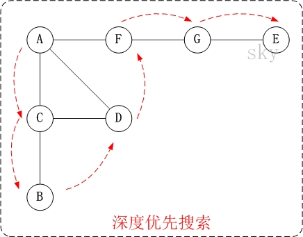
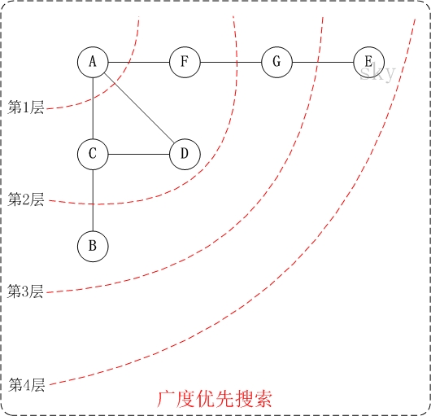
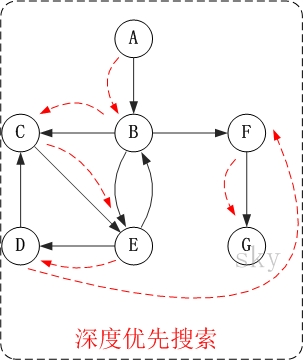
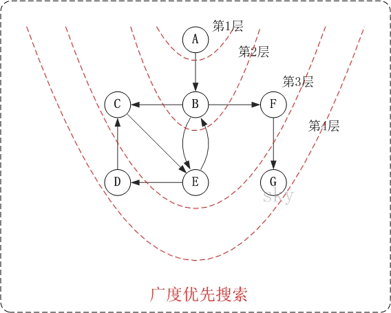

1. 无向图
   * 深度优先  
     
   * 广度优先  
     
2. 有向图
   * 深度优先  
     
   * 广度优先  
     
3. 语言描述
   * 深度优先  
     从某一个顶点N出发，首先访问该顶点，然后依次从他的未被访问的各个邻接点出发深度优先搜索遍历图，直至图中所有和N有
     路径相通的所有顶点都被访问到；
     若此时尚有其他顶点未被访问到，则另选一个未被访问的顶点作起始点，重复上述过程，直至图中所有顶点都被访问到为止。
     可以通过递归完成，也可以借助栈。
     * **重点：树只是一种特殊的图，树的前中后序遍历都可以归结于深度优先遍历，只是各个节点的访问顺序不同**
   * 广度优先  
     从图中某顶点N出发，在访问了N之后依次访问N的各个未曾访问过的邻接点，然后分别从这些邻接点出发依次访问它们的邻接点，
     并使得“先被访问的顶点的邻接点先于后被访问的顶点的邻接点被访问，直至图中所有已被访问的顶点的邻接点都被访问到。
     如果此时图中尚有顶点未被访问，则需要另选一个未曾被访问过的顶点作为新的起始点，重复上述过程，直至图中所有顶点都被访问到为止。
   * 简单的讲，深度优先就是顺着一条路走到底，然后走另一条路进行遍历；广度优先就是从一个顶点开始一层一层向下遍历

